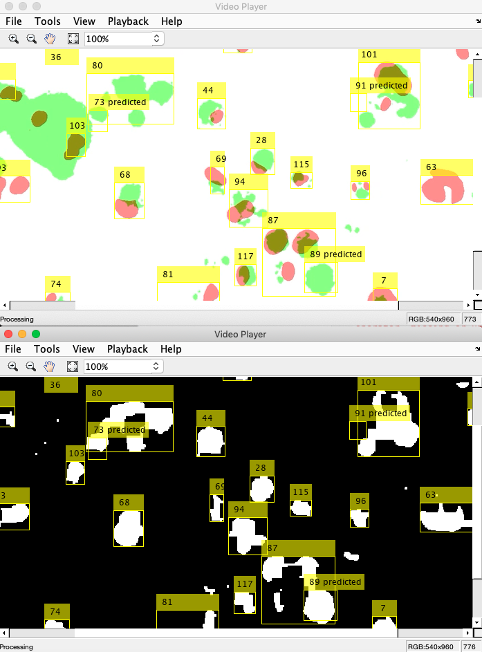
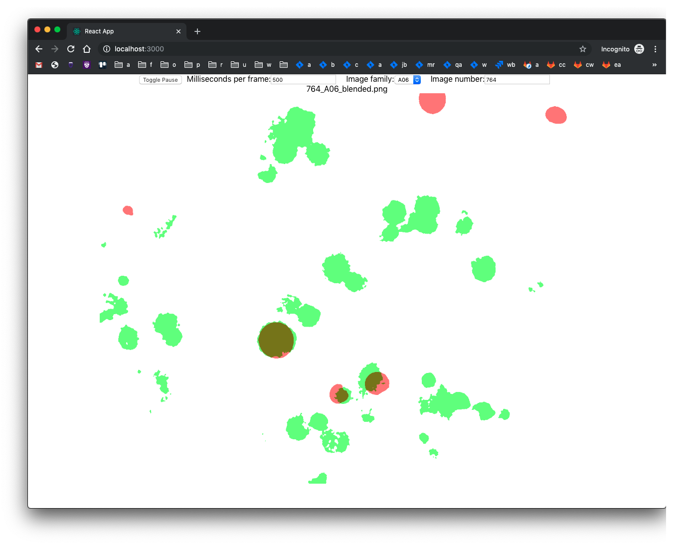
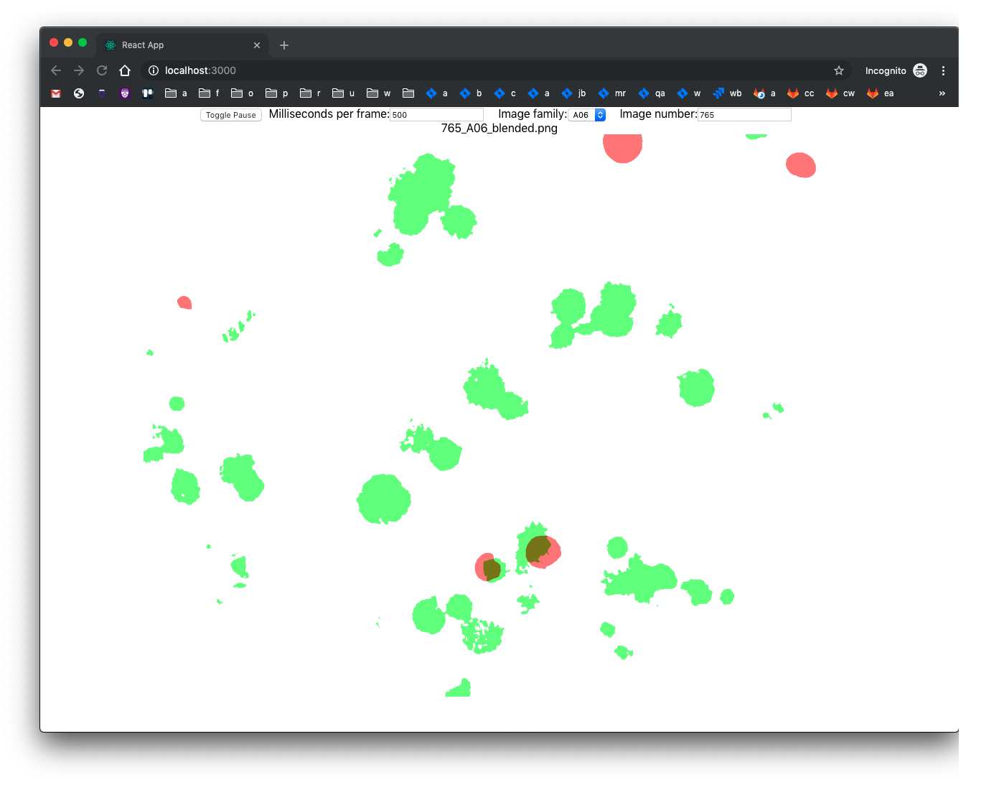

# SEIS_764_Project: Cancer Cell Analysis

- SEIS 764-01 Artificial Intelligence, Professor Chih Lai, Fall 2019
- Group members:
  - Ben Christian
  - Craig Gabel
  - Eric Helander
  - Jeffrey Kropelnicki
- Presentation: [SEIS764_Project_Presentation](SEIS764_Project_Presentation.pptx)

## [images](images)

- Folder containing the images used by the cell_object_detection and the LSTM_frame_prediction, the program
that creates the annotation files necessary for object detection in Detecron2, and the program that creates
the blending images

- Programs
 - generate_cell_detection_dataset.py
  - To run, simply start program and it will find the images based on their relative path
  - Reads from the ./images/raw folder and outputs the annotations
    and the annotation images to ./images/raw/cell_obj_detection_images
 - blend_raw_images.py
  - To run, simply start program and it will find the images based on their relative path
  - Reads from the ./images/raw folder and outputs the blended images to the ./images/{image set}/

## [cell_object_detection](cell_object_detection)
- Folder containing the jupyter notebook for the cell object detection
 - To run, please follow the guide in the jupyter notebook which will instruct you how to setup the Azure VM.

## [LSTM_frame_prediction](LSTM_frame_prediction)

- dependencies for lstm.py: tensor flow, keras, numpy, matplotlib, opencv
- To run the application:
  - run with the command: python lstm.py
    - output files are the predicted images, labelled with their order
      - y_test_combined_*.png <-- these represent the results of prediction method 1 ("first method" as described in slide 15 of provided pptx presentation)
      - future_combined_*.png <-- these represent the results of prediction method 2 ("second method" as described in slide 15 of provided pptx presentation)
      - for both sets of outputs, the y_true image appears on the left, and the y_predicted iamge appears on the right
      - you can control which sets of predictions are created by commenting out either line 138 or 139
    - the submitted code file should read the provided weights file (weights_gp.h5) and make predictions.  You can train your own model by commenting out line 136, and uncommenting line 134 (and optionally line 135)
    - important model hyperparameters:
      - model architecture: lines 16-36
        - LSTM layer count, filter count, kernel size, input shape
      - source and target data: lines 42-47
        - sequence size, sequence count, image dimensions, image directories to use (by default is only 1...you need lots of memory to use more than 1)
      - training parameters: line 134
        - epoch count, batch size, size of validation split

## [matlabMotionBasedMultipleObjectTracking](matlabMotionBasedMultipleObjectTracking)

- The MatLab motionBasedMultipleObjectTracking detects and tracks object motion in a video file. The following screenshot is from the `A01` set of images:
  - 
- To run the application:
  1. Open MatLab and run `matlabMotionBasedMultipleObjectTracking/motionBasedMultipleObjectTracking.m`.
     - The file currently points to `matlabMotionBasedMultipleObjectTracking/A_01.mp4`. To use a different video file, simply change the `VIDEO_FILE` path.

## [reactPhotoViewer](reactPhotoViewer)

- The browser-based React Photo Viewer application enables a user to view images sequentially, with full control over the number of milliseconds per frame. This is particularly useful for observing changes between frames, such as the phase change observed in image family `A06` between images `764` and `765`.
  - 
  - 
- Prerequisites for running the application:
  - Install [Node.js](https://nodejs.org/en/)
  - Install [yarn](https://yarnpkg.com/lang/en/docs/install/)
- To run the application:
  1. `cd` into the `reactPhotoViewer` directory.
  2. Run `yarn` to install the application's dependencies.
  3. Run `yarn start` to start the application.
  4. Navigate to [http://localhost:3000/](http://localhost:3000/)

## [images](images)
  - this directory holds all images used for all our models
    - A01, A02, A03, A04, A05, A06: (need description on what these are and how they were made???)
    - A0x_compressed: these images are compressed for use with memory and speed limited computing resources.  They currently hold resized versions of the original images (original: 1328 x 1048, resized: 120x95).  A script file (images/compress.sh) can be used to resize the images to different sizes.
  - dependencies for compress.sh: [imagemagick](https://imagemagick.org/index.php)
